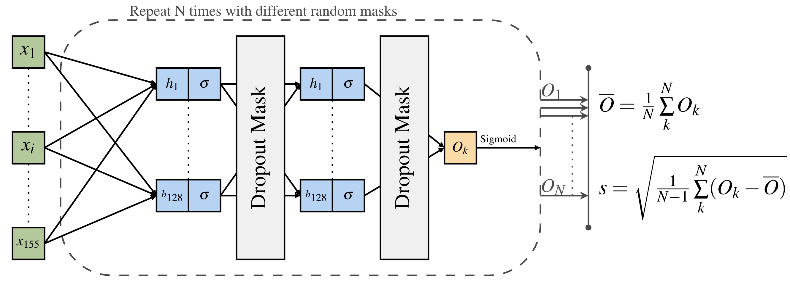

# Identifying healthy individuals with Alzheimer neuroimaging phenotypes in the UK Biobank

*Tiago Azevedo, Richard A.I. Bethlehem, David J. Whiteside, Nol Swaddiwudhipong, James B. Rowe, Pietro Lió, Timothy Rittman*

This repository contains all the code necessary to run and further extend the experiments presented in the following preprint: XXXX

## Abstract

Identifying prediagnostic neurodegenerative disease is a critical issue in neurodegenerative disease research, and Alzheimer's disease (AD) in particular, to identify populations suitable for preventive and early disease modifying trials. Evidence from genetic studies suggest the neurodegeneration of Alzheimer's disease measured by brain atrophy starts many years before diagnosis, but it is unclear whether these changes can be detected in sporadic disease. To address this challenge we train a Bayesian machine learning neural network model to generate a neuroimaging phenotype and AD-score representing the probability of AD using structural MRI data in the Alzheimer's Disease Neuroimaging Cohort (cut-off 0.5, AUC 0.92, PPV 0.90, NPV 0.93). We go on to validate the model in an independent real world dataset of the National Alzheimer's Coordinating Centre (AUC 0.74, PPV 0.65, NPV 0.80), and demonstrate correlation of the AD-score with cognitive scores in those with an AD-score above 0.5. We then apply the model to a healthy population in the UK Biobank study to identify a cohort at risk for Alzheimer's disease. This cohort have a cognitive profile in keeping with Alzheimer's disease, with strong evidence for poorer fluid intelligence, and with some evidence of poorer performance on tests of numeric memory, reaction time, working memory and prospective memory. We found some evidence in the AD-score positive cohort for modifiable risk factors of hypertension and smoking. This approach demonstrates the feasibility of using AI methods to identify a potentially prediagnostic population at high risk for developing sporadic Alzheimer's disease.

## Information

We are preparing documentation to add to this repository, which is expected to be concluded by the end of February 2022.
